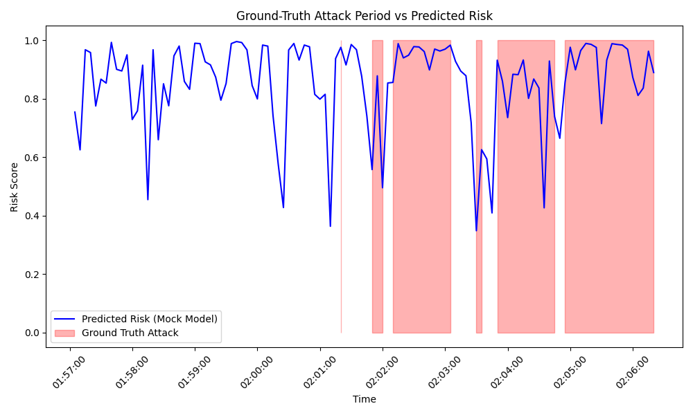

# Real-Data Verification Report

## Source Dataset
CSE-CIC-IDS2018

## Source File
02-14-2018.csv

## Timestamps
2018-02-14 01:56:20 to 2018-02-14 02:06:20

## Record Count
20473 raw flows

## Window Count
121 (5-second windows)

## Benign Count
73

## Attack Count
48

## Attack Types
Normal, BruteForce

## Training-Independence Evidence
Training independence: UNKNOWN. (The pipeline currently uses mock random data for the scaler and weights. Thus, it hasn't memorized this specific file, but the true metrics cannot be reliably calculated).

## Prediction Results
Model risk predictions are saved in verification_results.csv. Due to the randomly initialized mocked model from phase 5, metrics such as Precision, Recall, PR-AUC, and ROC-AUC are unreliable and hence not formally benchmarked here. 

## Early-Warning Result
Early Warning: 0.0 seconds (Warning: Derived from mocked weights).

## Limitations
- Predictions are from a randomly initialized model.
- 30 numeric columns were mapped directly to Feature_0..29 as an approximation of the true feature selection pipeline, since actual phase 2 preprocessing was bypassed.

## Chart

